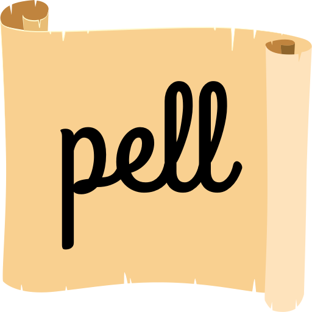

[](https://www.npmjs.com/package/pell)
[](https://cdnjs.com/libraries/pell)

> pell is the simplest and smallest WYSIWYG text editor for web, with no dependencies

Live demo: [https://jaredreich.com/pell](https://jaredreich.com/pell)

[](https://jaredreich.com/pell)

## Comparisons

| library       | size (min+gzip) | size (min) | jquery | bootstrap | react | link |
|---------------|-----------------|------------|--------|-----------|-------|------|
| pell          | 1.38kB          | 3.54kB     |        |           |       | https://github.com/jaredreich/pell |
| squire        | 16kB            | 49kB       |        |           |       | https://github.com/neilj/Squire |
| medium-editor | 27kB            | 105kB      |        |           |       | https://github.com/yabwe/medium-editor |
| quill         | 43kB            | 205kB      |        |           |       | https://github.com/quilljs/quill |
| trix          | 47kB            | 204kB      |        |           |       | https://github.com/basecamp/trix |
| ckeditor      | 163kB           | 551kB      |        |           |       | https://ckeditor.com |
| trumbowyg     | 8kB             | 23kB       | x      |           |       | https://github.com/Alex-D/Trumbowyg |
| summernote    | 26kB            | 93kB       | x      | x         |       | https://github.com/summernote/summernote |
| draft         | 46kB            | 147kB      |        |           | x     | https://github.com/facebook/draft-js |
| froala        | 52kB            | 186kB      | x      |           |       | https://github.com/froala/wysiwyg-editor |
| tinymce       | 157kB           | 491kB      | x      |           |       | https://github.com/tinymce/tinymce |

## Features

* Pure JavaScript, no dependencies, written in ES6
* Easily customizable with the sass file (pell.scss) or overwrite the CSS

Included actions:
- Bold
- Italic
- Underline
- Strike-through
- Heading 1
- Heading 2
- Paragraph
- Quote
- Ordered List
- Unordered List
- Code
- Horizontal Rule
- Link
- Image

Other available actions (listed at https://developer.mozilla.org/en-US/docs/Web/API/Document/execCommand):
- Justify Center
- Justify Full
- Justify Left
- Justify Right
- Subscript
- Superscript
- Font Name
- Font Size
- Indent
- Outdent
- Clear Formatting
- Undo
- Redo

Or create any custom action!

## Browser Support

* IE 9+ (theoretically, but good luck)
* Chrome 5+
* Firefox 4+
* Safari 5+
* Opera 11.6+

## Installation

#### npm:

```bash
npm install --save pell
```

#### HTML:

```html
<head>
  ...
  <link rel="stylesheet" type="text/css" href="https://unpkg.com/pell/dist/pell.min.css">
  <style>
    /* override styles here */
    .pell-content {
      background-color: pink;
    }
  </style>
</head>
<body>
  ...
  <!-- Bottom of body -->
  <script src="https://unpkg.com/pell"></script>
</body>
```

## Usage

#### API

```js
// ES6
import pell from 'pell'
// or
import { exec, init } from 'pell'
```

```js
// Browser
pell
// or
window.pell
```

```js
// Initialize pell on an HTMLElement
pell.init({
  // <HTMLElement>, required
  element: document.getElementById('some-id'),

  // <Function>, required
  // Use the output html, triggered by element's `oninput` event
  onChange: html => console.log(html),

  // <string>, optional, default = 'div'
  // Instructs the editor which element to inject via the return key
  defaultParagraphSeparator: 'div',

  // <boolean>, optional, default = false
  // Outputs <span style="font-weight: bold;"></span> instead of <b></b>
  styleWithCSS: false,

  // <Array[string | Object]>, string if overwriting, object if customizing/creating
  // action.name<string> (only required if overwriting)
  // action.icon<string> (optional if overwriting, required if custom action)
  // action.title<string> (optional)
  // action.result<Function> (required)
  // Specify the actions you specifically want (in order)
  actions: [
    'bold',
    {
      name: 'custom',
      icon: 'C',
      title: 'Custom Action',
      result: () => console.log('Do something!')
    },
    'underline'
  ],

  // classes<Array[string]> (optional)
  // Choose your custom class names
  classes: {
    actionbar: 'pell-actionbar',
    button: 'pell-button',
    content: 'pell-content',
    selected: 'pell-button-selected'
  }
})

// Execute a document command, see reference:
// https://developer.mozilla.org/en/docs/Web/API/Document/execCommand
// this is just `document.execCommand(command, false, value)`
pell.exec(command<string>, value<string>)
```

#### List of overwriteable action names
- bold
- italic
- underline
- strikethrough
- heading1
- heading2
- paragraph
- quote
- olist
- ulist
- code
- line
- link
- image

## Examples

#### General

```html
<div id="editor" class="pell"></div>
<div>
  HTML output:
  <div id="html-output" style="white-space:pre-wrap;"></div>
</div>
```

```js
import { exec, init } from 'pell'

const editor = init({
  element: document.getElementById('editor'),
  onChange: html => {
    document.getElementById('html-output').textContent = html
  },
  defaultParagraphSeparator: 'p',
  styleWithCSS: true,
  actions: [
    'bold',
    'underline',
    {
      name: 'italic',
      result: () => exec('italic')
    },
    {
      name: 'backColor',
      icon: '<div style="background-color:pink;">A</div>',
      title: 'Highlight Color',
      result: () => exec('backColor', 'pink')
    },
    {
      name: 'image',
      result: () => {
        const url = window.prompt('Enter the image URL')
        if (url) exec('insertImage', url)
      }
    },
    {
      name: 'link',
      result: () => {
        const url = window.prompt('Enter the link URL')
        if (url) exec('createLink', url)
      }
    }
  ],
  classes: {
    actionbar: 'pell-actionbar-custom-name',
    button: 'pell-button-custom-name',
    content: 'pell-content-custom-name',
    selected: 'pell-button-selected-custom-name'
  }
})

// editor.content<HTMLElement>
// To change the editor's content:
editor.content.innerHTML = '<b><u><i>Initial content!</i></u></b>'
```

#### Example (Markdown)

```html
<div id="editor" class="pell"></div>
<div>
  Markdown output:
  <div id="markdown-output" style="white-space:pre-wrap;"></div>
</div>
```

```js
import { init } from 'pell'
import Turndown from 'turndown'

const { turndown } = new Turndown({ headingStyle: 'atx' })

init({
  element: document.getElementById('editor'),
  actions: ['bold', 'italic', 'heading1', 'heading2', 'olist', 'ulist'],
  onChange: html => {
    document.getElementById('markdown-output').innerHTML = turndown(html)
  }
})
```

#### Frameworks

- [React](/examples/react.md)

## Custom Styles

#### SCSS

```scss
$pell-content-height: 400px;
// See all overwriteable variables in src/pell.scss

// Then import pell.scss into styles:
@import '../../node_modules/pell/src/pell';
```

#### CSS

```css
/* After pell styles are applied to DOM: */
.pell-content {
  height: 400px;
}
```

## License

MIT
